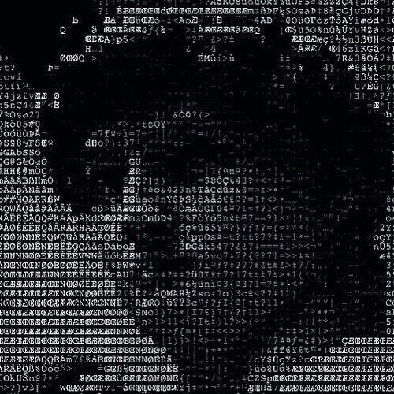

   <!-- Banner -->
   

   
   <!-- Título principal -->
   
   

<!-- Sobre mim -->
<h2 style="color:#ba1818; font-weight:bold;">💻 Sobre mim</h2>

Sou desenvolvedora web com experiência na criação de sistemas e manutenção de aplicações, sempre focada em código limpo, performance e boas práticas.  

Atuo também com RPA (Automação de Processos), desenvolvendo fluxos que interagem com sistemas web, incluindo cenários com antibot e captchas.  

No tempo livre, desenvolvo jogos e participo de Game Jams, criando soluções criativas sob pressão — o que fortalece minha capacidade de resolver problemas e trabalhar em equipe.

---

<!-- Tecnologias -->
<h2 style="color:#ba1818; font-weight:bold;">🚀 Tecnologias</h2>

<!-- Front-End -->
<h3>🎨 Front-End</h3>

<!-- Back-End -->
<h3>🧠 Back-End</h3>

<!-- Game Dev -->
<h3>🎮 Game Dev</h3>

<!-- RPA -->
<h3>🤖 RPA</h3>

<!-- Infra -->
<h3>☁️ Infra & Cloud</h3>

<!-- Banco -->
<h3>🗄️ Bancos de Dados</h3>

<!-- Extras -->
<h3>🛠️ Outras Habilidades</h3>

---

<!-- Estatísticas -->
<h2 style="color:#ba1818;">📊 Estatísticas</h2>

  
  

---

<!-- Contato -->
<h2 style="color:#ba1818;">📬 Contato</h2>

---

<!-- Banner final -->
