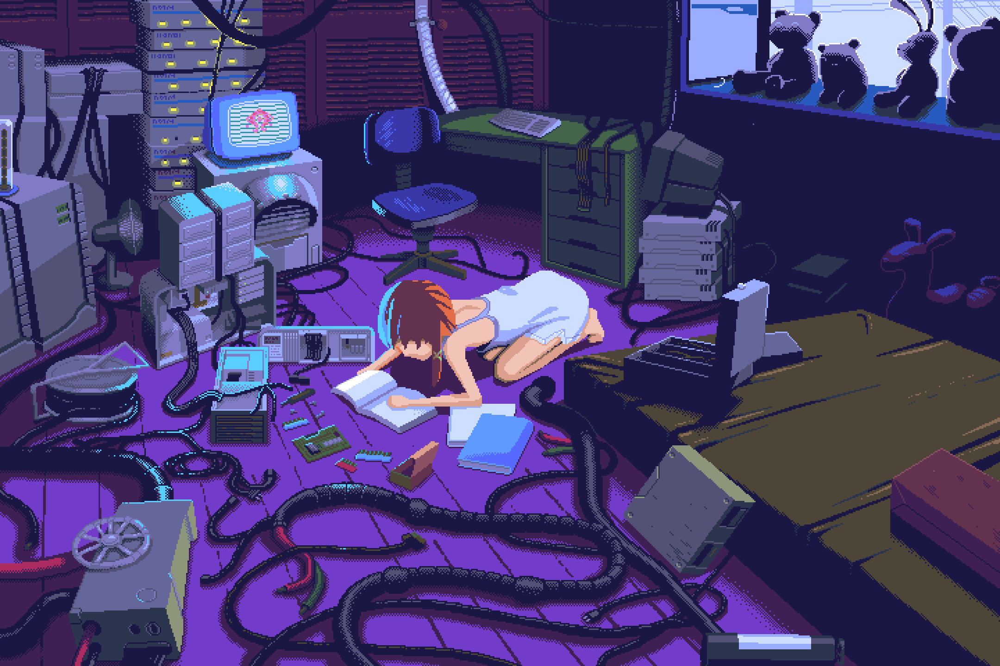

   

   

   

   

<h2>💻 Sobre mim</h2>

Sou desenvolvedora web com experiência na criação de sistemas web e manutenção de aplicações já existentes, sempre buscando código limpo, performance e soluções bem estruturadas.

Atuo também com RPA (Automação de Processos), desenvolvendo fluxos automatizados que interagem com sistemas web, lidando com mecanismos de proteção como antibot e diferentes tipos de captchas. Resolver esses desafios técnicos é algo que me motiva e me faz evoluir constantemente como desenvolvedora.

Além disso, desenvolvo jogos no meu tempo livre. Já participei de diversas Game Jams com um grupo de amigos, criando experiências criativas sob pressão e prazo limitado — algo que fortaleceu muito meu trabalho em equipe, organização e capacidade de prototipação rápida.

Minha paixão por jogos, especialmente aqueles focados em enigmas e desafios lógicos, foi o que despertou ainda mais meu interesse por automação e resolução de problemas complexos. Encontrar padrões, entender sistemas e superar obstáculos técnicos é o que realmente me move.

<h2>🚀 Tecnologias</h2>

<h4>🎮 Games</h4>

  
  
  

<h4>🧭 WEB</h4>

  
  
  
  
  
  
  
  

<h4>🤖 RPA</h4>

  
  
  
  
  

<h4>☁️ Infra & Cloud</h4>

  
  
  
  

<h2>📃 Estatísticas</h2>

  
  

<h2>☎️ Contato</h2>

  
  

