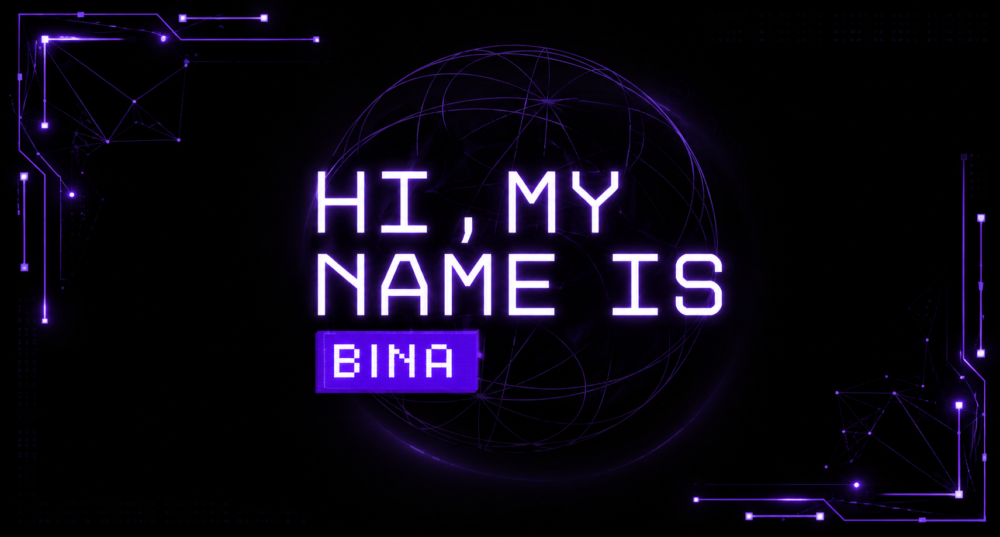

<!-- Banner -->

 

## 😎 Um pouco sobre mim

Sou desenvolvedora focada em desenvolvimento web e automações, sempre buscando evoluir minhas habilidades e criar projetos práticos que resolvem problemas reais.

Tenho interesse especial em segurança da informação, automação de processos e desenvolvimento backend, além de gostar bastante de explorar novas tecnologias e ferramentas do ecossistema web.

Gosto de aprender na prática, desenvolvendo projetos pessoais, testando ideias e melhorando constantemente meu código e minha lógica de programação.

📁 <b>Portfolio:</b> <a href="https://bina663.github.io/sabrina/">Clique aqui</a> 
💼 <b>LinkedIn:</b> <a href="https://www.linkedin.com/in/sabrina-oliveira-ba80031b0/">Perfil</a> 
💬 <b>Discord:</b> binaoliver 
🐦 <b>X (Twitter):</b> <a href="https://x.com/bina26792860">Perfil</a>

---

## 🚀 Tecnologias que eu uso

| 💻 Front-end | ⚙️ Back-end | 🗄️ Banco de Dados | 🔧 Ferramentas | 📱 Outros |
|--------------|------------|------------------|---------------|----------|
| HTML5        | Node.js    | MySQL            | Git           | APIs REST |
| CSS3         | PHP        | MongoDB          | GitHub        | Automação com JS |
| JavaScript   | Laravel    |                  | VS Code       | Playwright |
| Vue / React  |            |                  | Postman       | Puppeteer |
| Tailwind CSS |            |                  | Docker        | Linux |